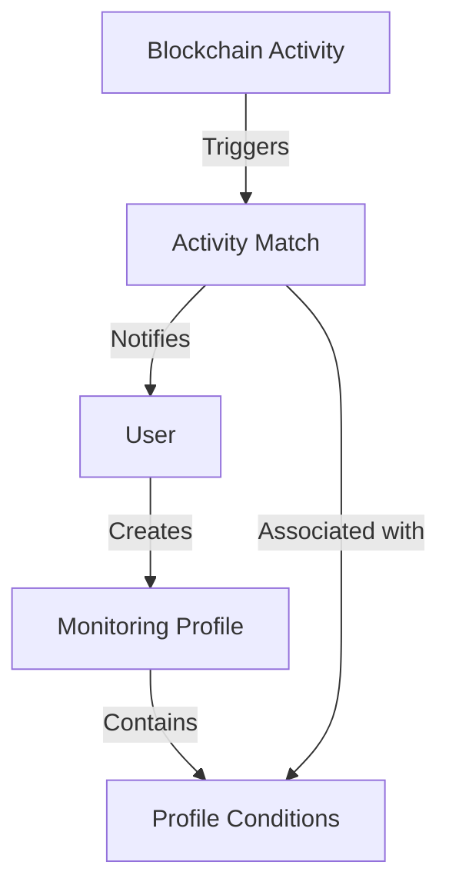

# Blockchain Activity Monitor (CryptoScope)

A decentralized smart contract system for tracking and monitoring on-chain activities with customizable alert conditions and notifications.

## Overview

Blockchain Activity Monitor enables users to create and manage monitoring profiles that track specific blockchain activities, including:
- Transaction monitoring
- Contract call tracking
- Token transfer surveillance
- Wallet activity observation

Users can define custom alert conditions and receive notifications when their specified criteria are met, providing a powerful tool for blockchain analytics and activity tracking.

## Architecture

The system is built around three main data structures:
- Monitoring Profiles: Store user-defined monitoring configurations
- Profile Conditions: Define specific criteria for tracking
- Activity Matches: Record events that match the defined conditions



## Contract Documentation

### activity-monitor.clar

The main contract that implements the monitoring system functionality.

#### Key Components

1. **Monitoring Profiles**
   - Unique profile ID
   - Owner information
   - Profile metadata
   - Notification settings

2. **Activity Types**
   - Transaction (1)
   - Contract Call (2)
   - Token Transfer (3)
   - Wallet Activity (4)

3. **Profile Conditions**
   - Activity type
   - Address filters
   - Contract/function specifications
   - Amount thresholds
   - Token identifiers

## Getting Started

### Prerequisites
- Clarinet
- Stacks wallet for deployment

### Usage Example

1. Create a monitoring profile:
```clarity
(contract-call? 
  .activity-monitor 
  create-profile 
  "High-Value Transfers" 
  "Monitor transfers above 1000 STX" 
  (some "https://api.example.com/notifications"))
```

2. Add a monitoring condition:
```clarity
(contract-call? 
  .activity-monitor 
  add-condition
  u1 ;; profile-id
  u3 ;; activity-type-token-transfer
  none ;; address
  none ;; contract-name
  none ;; function-name
  (some u1000000000) ;; min-amount
  none ;; max-amount
  none) ;; token-id
```

## Function Reference

### Profile Management

```clarity
(create-profile (name (string-ascii 50)) 
                (description (string-ascii 200))
                (notification-endpoint (optional (string-ascii 100))))
```
Creates a new monitoring profile.

```clarity
(update-profile (profile-id uint)
                (name (string-ascii 50))
                (description (string-ascii 200))
                (notification-endpoint (optional (string-ascii 100))))
```
Updates an existing profile.

### Condition Management

```clarity
(add-condition (profile-id uint)
               (activity-type uint)
               (address (optional principal))
               (contract-name (optional (string-ascii 128)))
               (function-name (optional (string-ascii 128)))
               (min-amount (optional uint))
               (max-amount (optional uint))
               (token-id (optional (string-ascii 50))))
```
Adds a new monitoring condition to a profile.

### Activity Tracking

```clarity
(record-activity-match (profile-id uint)
                      (condition-id uint)
                      (tx-id (string-ascii 64))
                      (details (string-ascii 200)))
```
Records an activity that matches monitoring conditions.

## Development

### Testing

1. Clone the repository
2. Install Clarinet
3. Run the test suite:
```bash
clarinet test
```

### Local Development

1. Start Clarinet console:
```bash
clarinet console
```

2. Deploy the contract:
```bash
clarinet deploy
```

## Security Considerations

1. **Access Control**
   - Only profile owners can modify their profiles and conditions
   - Activity match recording should be restricted to authorized entities

2. **Resource Limits**
   - Profile names limited to 50 characters
   - Descriptions limited to 200 characters
   - Condition parameters have appropriate size limits

3. **Data Privacy**
   - Consider that all monitoring data is public on-chain
   - Use optional notification endpoints for private notifications

4. **Known Limitations**
   - Inefficient profile lookup by name (linear search)
   - No built-in notification delivery mechanism
   - All conditions and matches stored on-chain